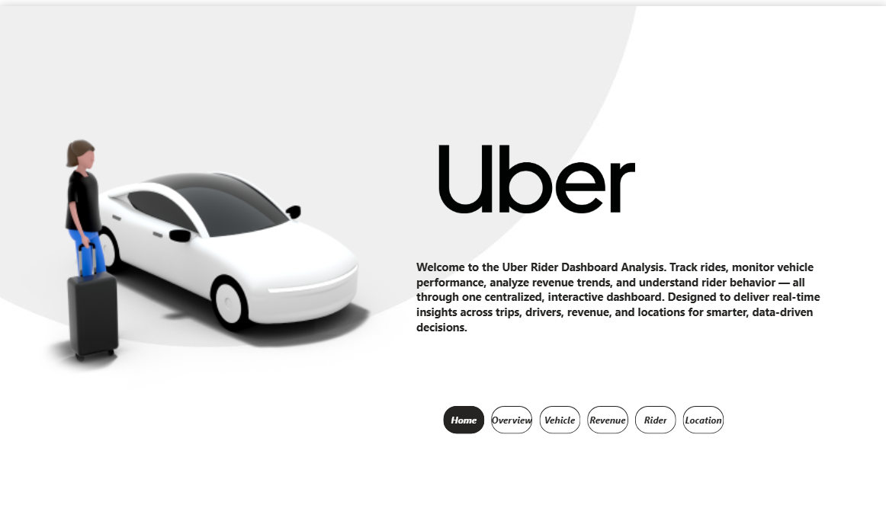
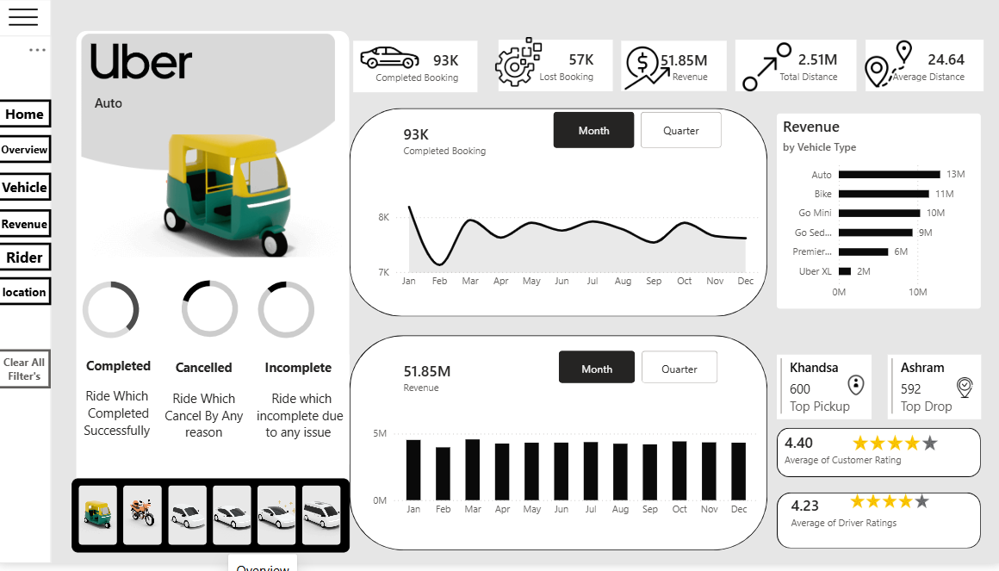
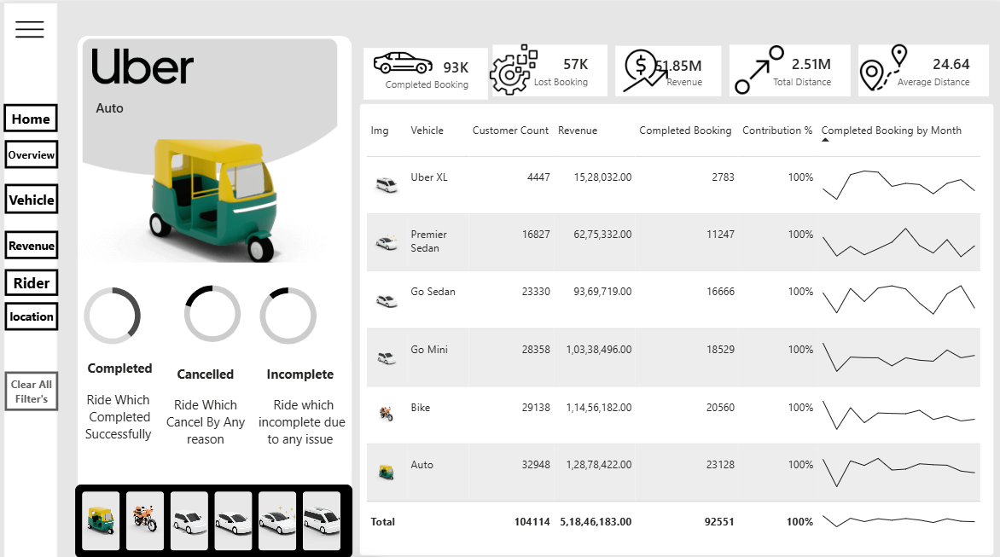
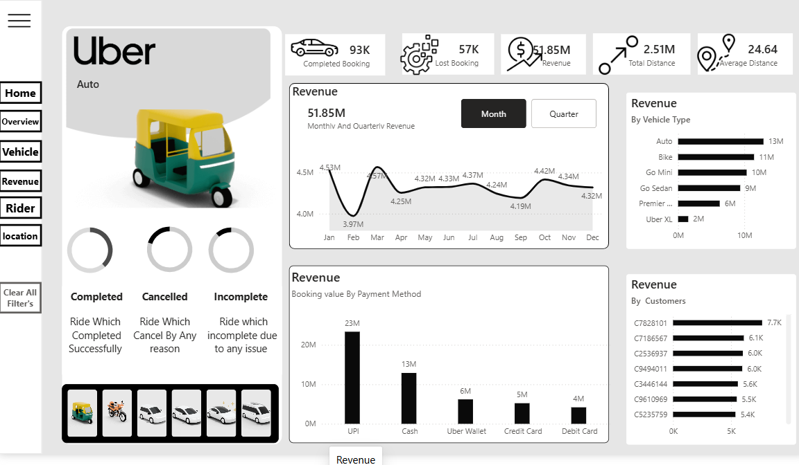
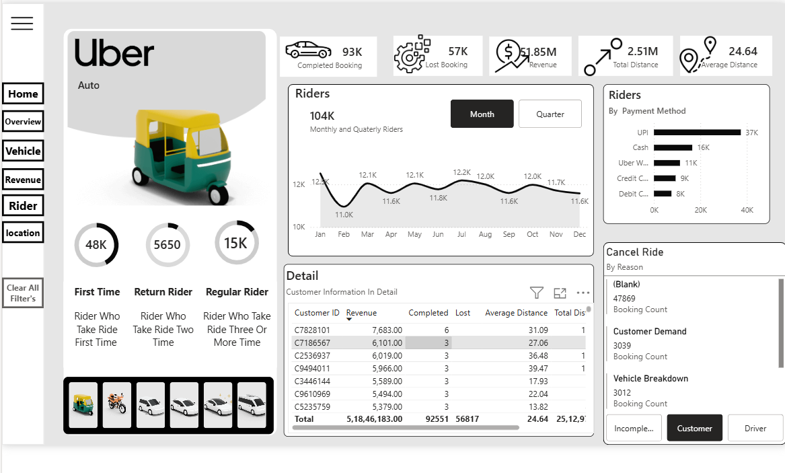
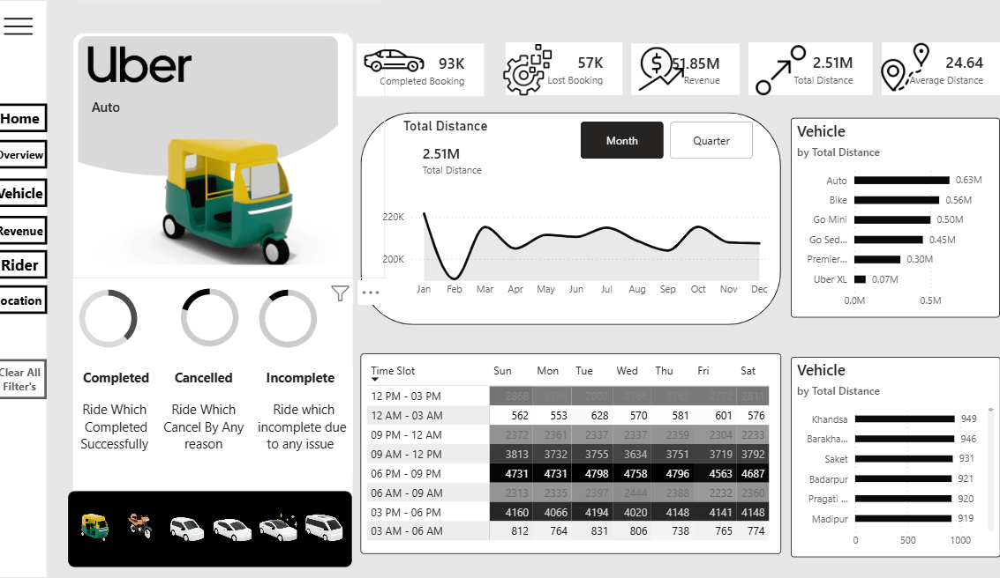

<div align="center">

# 🚖 Uber Ride Analytics Dashboard

### An end-to-end interactive Power BI dashboard analyzing 1.5L+ Uber ride records


</div>

---

## 📖 Overview

Welcome to the **Uber Ride Analytics Dashboard** — a centralized, interactive Power BI report that tracks rides, monitors vehicle performance, analyzes revenue trends, and uncovers rider behavior patterns. Built to deliver real-time insights across trips, drivers, revenue, and locations for smarter, data-driven decision-making.

The dashboard spans **6 fully interactive pages**: `Home` · `Overview` · `Vehicle` · `Revenue` · `Rider` · `Location`

---

## 📌 Key Metrics

<div align="center">

| 🚗 Completed Bookings | ❌ Lost Bookings | 💰 Total Revenue | 📏 Total Distance | 📍 Avg. Distance/Ride |
|:---:|:---:|:---:|:---:|:---:|
| **93K** | **57K** | **Rs. 51.85M** | **2.51M** | **24.64** |

</div>

---

## 🗂️ Dashboard Pages

### 🏠 Home
Landing page introducing the dashboard's purpose with quick navigation to every report page.

### 📈 Overview
- Monthly / quarterly completed booking & revenue trends
- Revenue split across 6 vehicle types (Auto, Bike, Go Mini, Go Sedan, Premier Sedan, Uber XL)
- Completed / Cancelled / Incomplete ride breakdown
- Top pickup & drop locations
- Average customer rating **4.40★** · average driver rating **4.23★**

### 🚗 Vehicle
- Vehicle-wise performance table — Customer Count, Revenue, Completed Bookings, Contribution %, monthly trend
- **Totals:** 1,04,114 customers · Rs. 5,18,46,183 revenue · 92,551 completed bookings

### 💰 Revenue
- Monthly & quarterly revenue trend
- Revenue by payment method — UPI, Cash, Uber Wallet, Credit Card, Debit Card
- Top customers by revenue contribution

### 🧍 Rider
- Rider segmentation — **48K First-Time**, **5,650 Return**, **15K Regular**
- Monthly/quarterly rider trend (104K total riders)
- Riders by payment method
- Customer-level detail table (Revenue, Completed, Lost, Avg. Distance)
- Cancellation reason breakdown

### 📍 Location
- Total distance trend by month/quarter
- Vehicle-wise distance breakdown
- Time-slot heatmap — bookings by day of week & time
- Top locations by distance — Khandsa, Barakhamba, Saket, Badarpur, Pragati Maidan, Madipur

---

## 🎛️ Interactive Filters

Every page shares a synced global filter panel:

`Drop Location` · `Pickup Location` · `Customer ID` · `Time Slot` · `Vehicle Type` · `Payment Method`

---

## 🛠️ Tech Stack

| Tool | Purpose |
|---|---|
| **Power BI** | Dashboard design & data modeling |
| **DAX** | Custom KPI measures & calculations |
| **Excel** | Data cleaning & validation |
| **SQL** | Data extraction & aggregation |

---

## 🖼️ Preview

<div align="center">

| Home | Overview |
|:---:|:---:|
|  |  |

| Vehicle | Revenue |
|:---:|:---:|
|  |  |

| Rider | Location |
|:---:|:---:|
|  |  |

</div>

---

## 📂 Repository Structure

```
├── Uber_Dashboard.pbix     # Power BI project file
├── screenshots/            # Dashboard page previews
│   ├── home.png
│   ├── overview.png
│   ├── vehicle.png
│   ├── revenue.png
│   ├── rider.png
│   └── location.png
└── README.md
```

---

<div align="center">

Built with 📊 by **Rajat Bareja**

[](https://www.linkedin.com/in/rajat-bareja-b98269394/)
[](https://github.com/RajatBareja)

</div>
